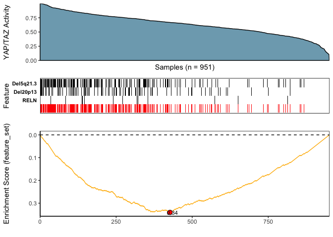
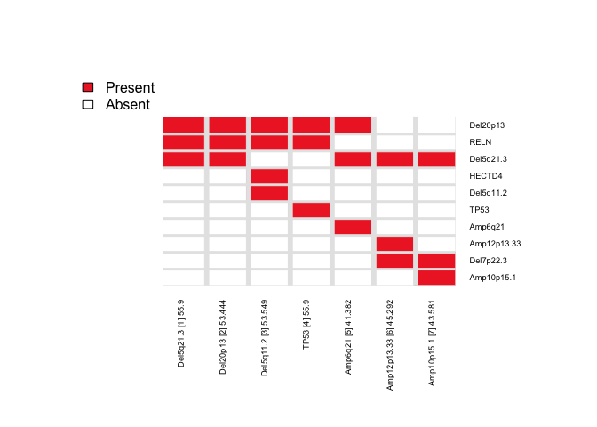

<!-- README.md is generated from README.Rmd. Please edit that file -->

# CaDrA


  

**Ca**ndidate **Dr**ivers **A**nalysis: Multi-Omic Search for Candidate
Drivers of Functional Signatures

**CaDrA** is an R package that supports a heuristic search framework
aimed at identifying candidate drivers of a molecular phenotype of
interest.

The main function takes two inputs:

1)  A binary multi-omics dataset, which can be represented as a matrix
    of binary features or a **SummarizedExperiment** class object where
    the rows are 1/0 vectors indicating the presence/absence of ‘omics’
    features (e.g. somatic mutations, copy number alterations,
    epigenetic marks, etc.), and the columns are the samples.
2)  A molecular phenotype of interest which can be represented as a
    vector of continuous scores (e.g. protein expression, pathway
    activity, etc.)

Based on these two inputs, **CaDrA** implements a forward and/or
backward search algorithm to find a set of features that together is
maximally associated with the observed input scores, based on one of
several scoring functions (*Kolmogorov-Smirnov*, *Conditional Mutual
Information*, *Wilcoxon*, or *custom-defined scoring function*), making
it useful to find complementary omics features likely driving the input
molecular phenotype.

Please see our [documentation](https://montilab.github.io/CaDrA/) for
additional examples.

# Web Interface

We developed an R Shiny Dashboard that would allow users to interact
with **CaDrA** directly without the need to install or maintain the
package.

See our web portal at <https://cadra.bu.edu/>

# Installation

- Using `devtools` package

``` r
library(devtools)
devtools::install_github("montilab/CaDrA")
```

- Using `BiocManager` package

``` r
# Install BiocManager
if (!require("BiocManager", quietly = TRUE))
    install.packages("BiocManager")

# Install CaDrA
BiocManager::install("CaDrA")

# Install SummarizedExperiment
BiocManager::install("SummarizedExperiment")
```

# Usage

Here, we are using a dataset of somatic mutations and CNAs extracted
from the TCGA Breast Cancer Dataset. We will query this Feature Set
based on an Input Score that measures the per-sample activity of YAP/TAZ
(two important regulators of the hippo pathway). This score represents
the projection on the TCGA BrCa dataset of a gene expression signature
of YAP/TAZ knockdown derived in breast cancer cell lines. Our question
of interest: what is the combination of genetic features \[mutations and
copy number alterations\] that best “explain” the YAP/TAZ activity?

## (i) Load R packages

``` r
library(CaDrA)
library(SummarizedExperiment)
```

## (ii) Format and filter data inputs

``` r
## Read in BRCA GISTIC+Mutation object
utils::data(BRCA_GISTIC_MUT_SIG)
eset_mut_scna <- BRCA_GISTIC_MUT_SIG

## Read in input score
utils::data(TAZYAP_BRCA_ACTIVITY)
input_score <- TAZYAP_BRCA_ACTIVITY

## Samples to keep based on the overlap between the two inputs
overlap <- base::intersect(base::names(input_score), base::colnames(eset_mut_scna))
eset_mut_scna <- eset_mut_scna[, overlap]
input_score <- input_score[overlap]

## Binarize FS to only have 0's and 1's
SummarizedExperiment::assay(eset_mut_scna)[SummarizedExperiment::assay(eset_mut_scna) > 1] <- 1.0

## Pre-filter FS based on occurrence frequency
eset_mut_scna_flt <- CaDrA::prefilter_data(
  FS = eset_mut_scna,
  max_cutoff = 0.6,  # max event frequency (60%)
  min_cutoff = 0.03  # min event frequency (3%)
)  
```

## (iii) Run CaDrA

Here, we repeat the candidate search starting from each of the top ‘N’
features and report the combined results as a heatmap (to summarize the
number of times each feature is selected across repeated runs).

IMPORTANT NOTE: The legacy function `topn_eval()` is equivalent to the
new recommended `candidate_search()` function

``` r
topn_res <- CaDrA::candidate_search(
  FS = eset_mut_scna_flt,
  input_score = input_score,
  method = "ks_pval",          # Use Kolmogorow-Smirnow scoring function 
  method_alternative = "less", # Use one-sided hypothesis testing
  weights = NULL,              # If weights is provided, perform a weighted-KS test
  search_method = "both",      # Apply both forward and backward search
  top_N = 7,                   # Evaluate top 7 starting points for each search
  max_size = 7,                # Maximum size a meta-feature matrix can extend to
  do_plot = FALSE,             # Plot after finding the best features
  best_score_only = FALSE      # Return all results from the search
)
```

## (iv) Visualize results

### Meta-feature plot

This plot produces 3 graphics stacked on top of each other:

1.  A density diagram of observed input scores sorted from highest to
    lowest
2.  A tile plot for the top meta-features that associated with a
    molecular phenotype of interest (e.g. input_score)
3.  A KS enrichment plot of the meta-feature set (this correspond to the
    logical OR of the features)

``` r
## Fetch the meta-feature set corresponding to its best scores over top N features searches
topn_best_meta <- CaDrA::topn_best(topn_res)

# Visualize the best results with the meta-feature plot
CaDrA::meta_plot(topn_best_list = topn_best_meta, input_score_label = "YAP/TAZ Activity")
```

<!-- -->

### Top-N plot

This plot is a heatmap of overlapping meta-features by repeating
`candidate_search` over top N feature searches.

``` r
# Evaluate results across top N features you started from
CaDrA::topn_plot(topn_res) 
```

<!-- -->

# Additional guides

- [Run CaDrA within a Docker
  environment](https://montilab.github.io/CaDrA/articles/docker.html)

# Acknowledgements

This project is funded in part by the
[NIH/NIDCR](https://www.nidcr.nih.gov/) (3R01DE030350-01A1S1,
R01DE031831), [Find the Cause Breast Cancer
Foundation](https://findthecausebcf.org), and
[NIH/NIA](https://www.nia.nih.gov/) (UH3 AG064704).
