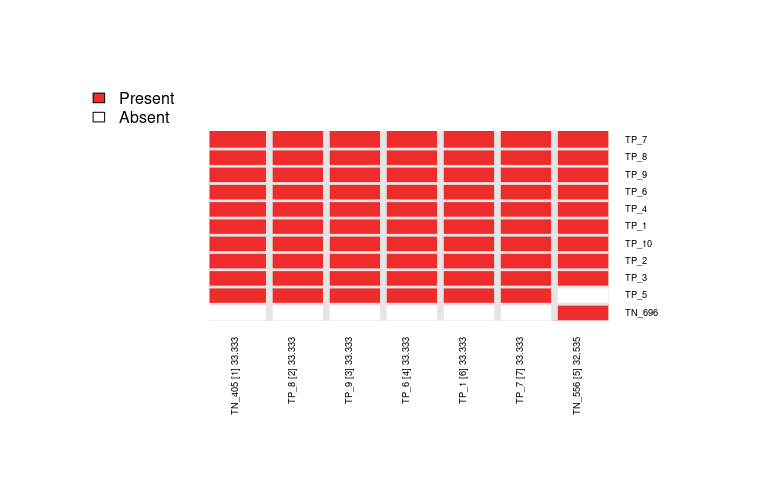

<!-- README.md is generated from README.Rmd. Please edit that file -->

# CaDrA

<!-- badges: start -->

[](https://github.com/montilab/CaDrA/actions)
<!-- badges: end -->

Candidate Drivers Analysis: Multi-Omic Search for Candidate Drivers of
Functional Signatures

CaDrA is an R package that supports a heuristic search framework aimed
at identifying candidate drivers of a molecular phenotype of interest. 
The main function takes two inputs: i) a binary multi-omics dataset (where 
the rows are 1/0 vectors indicating the presence/absence of 'omics' 
features such as somatic mutations, copy number alterations, epigenetic 
marks, etc.); and ii) and a molecular phenotype represented as a vector 
of continuous scores (sample-specific scores representing a phenotypic 
readout of interest, such as protein expression, pathway activity, etc.), 
Based on this input, CaDrA implements a forward/backward search algorithm 
to find the set of features that together is maximally associated with the 
observed input scores, based on one of several scoring functions (Kolmogorov-Smirnov, 
Conditional Mutual Information, Wilcoxon, custom-defined scoring function), 
making it useful to find complementary omics features likely driving the 
input molecular phenotype.

For more information, please see the associated manuscript [Kartha et
al. (2019)](https://www.frontiersin.org/articles/10.3389/fgene.2019.00121/full)

## (1) Installation

You can install the development version of CaDrA from GitHub
(**Recommended**)

``` r
library(devtools)
devtools::install_github("montilab/CaDrA")
```

## (2) Quickstart

``` r
library(CaDrA)
```

### Test run code on simulated data

``` r
# Load pre-computed Top-N list generated for sim.ES dataset
data(topn.list)

# Plot the results from a top-N evaluation by passing the resulting ESet from a specific run
# To find the combination of features that had the best score
best_meta <- topn_best(topn_list=topn.list) 

# Now we can plot this set of features
meta_plot(ESet=best_meta$ESet)
```


``` r
CaDrA::topn_plot(topn_list=topn.list)
```

    #> Generating top N overlap heatmap..



### Running on actual data

In the example below, the `CCLE_MUT_CNA_AMP_DEL_REVEALER` expression set
object was obtained from the **REVEALER** package. The second required input, 
named `input_score`, also obtained from **REVEALER**, contains
continuous measures of a targeted profile. The **input\_score** is what
dictates how CaDrA will search for grouped meta-features.

``` r
# Load features dataset object from REVEALER
data(CCLE_MUT_CNA_AMP_DEL_REVEALER)

# Load the targeted profile dataset
data(CTNBB1_transcriptional_reporter)

# Number of top starting seed features to test and evaluate over  
top_N <- 7

# Metric used for candidate search
# Either ks or wilcox or revealer are supported
method <- "ks"

topn_l <- CaDrA::topn_eval(ES = CCLE_MUT_CNA_AMP_DEL_REVEALER, 
                    input_score =  CTNBB1_transcriptional_reporter,
                    method = method,
                    alternative = "less",
                    metric = "pval",
                    top_N = top_N,
                    search_method = "both",
                    max_size = 7,
                    do_plot = FALSE,     #We will plot it AFTER finding the best hits
                    best_score_only = FALSE)

# Now we can fetch the ESet and feature that corresponded to the best score over the top N search
topn_best_meta <- topn_best(topn_l)

# Visualize best result
meta_plot(ESet = topn_best_meta$ESet,
          var_score = input_score,
          var_name = "Activity score") #Y-axis label for plot

# You can also evaluate how robust the results are depending on which seed feature you started with
topn_plot(topn_l) 
```
