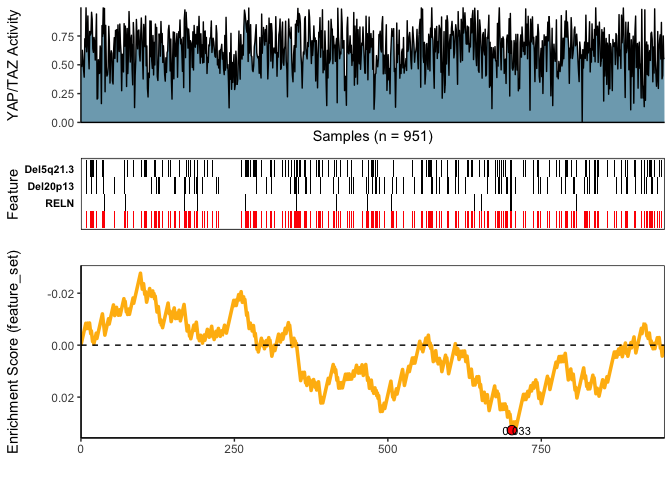
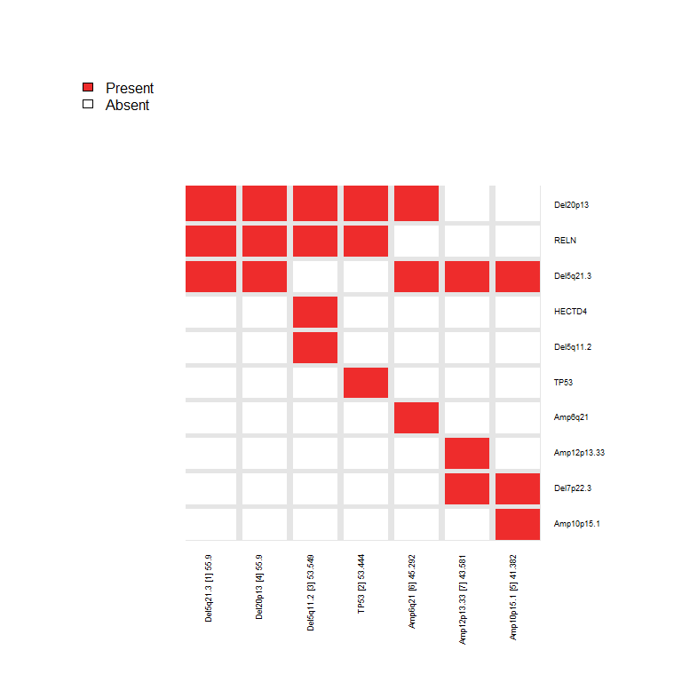

<!-- README.md is generated from README.Rmd. Please edit that file -->

# CaDrA

<!-- badges: start -->

[](https://github.com/montilab/CaDrA/actions)
<!-- badges: end -->

Candidate Drivers Analysis: Multi-Omic Search for Candidate Drivers of
Functional Signatures

CaDrA is an R package that supports a heuristic search framework aimed
at identifying candidate drivers of a molecular phenotype of interest.
The main function takes two inputs: i) a binary multi-omics dataset
(where the rows are 1/0 vectors indicating the presence/absence of
‘omics’ features such as somatic mutations, copy number alterations,
epigenetic marks, etc.); and ii) and a molecular phenotype represented
as a vector of continuous scores (sample-specific scores representing a
phenotypic readout of interest, such as protein expression, pathway
activity, etc.). Based on this input, CaDrA implements a
forward/backward search algorithm to find the set of features that
together is maximally associated with the observed input scores, based
on one of several scoring functions (Kolmogorov-Smirnov, Conditional
Mutual Information, Wilcoxon, custom-defined scoring function), making
it useful to find complementary omics features likely driving the input
molecular phenotype.

For more information, please see the associated manuscript [Kartha et
al. (2019)](https://www.frontiersin.org/articles/10.3389/fgene.2019.00121/full)

## (1) Installation

You can install the development version of CaDrA from GitHub
(**Recommended**)

``` r
library(devtools)
devtools::install_github("montilab/CaDrA", ref="dev")
```

## (2) Quickstart

``` r
library(CaDrA)
library(Biobase)
```

## CaDrA Query of BRCA YAP/TAZ Activity

Here, we reproduce the results of Figure 5 of [\[Kartha et al.,
2019\]](https://www.frontiersin.org/articles/10.3389/fgene.2019.00121/full)
(the section titled “*CaDrA Reveals Novel Drivers of Oncogenic YAP/TAZ
Activity in Human Breast Cancer*”).

## Load & Format Data Inputs

``` r
## Read in BRCA GISTIC+Mutation ESet object
data(BRCA_GISTIC_MUT_SIG)
eset_mut_scna <- BRCA_GISTIC_MUT_SIG

## Read in input score
data(TAZYAP_BRCA_ACTIVITY)
input_scores <- TAZYAP_BRCA_ACTIVITY

## Samples to keep based on the overlap between the two inputs
overlap <- intersect(names(input_scores), Biobase::sampleNames(eset_mut_scna))
eset_mut_scna <- eset_mut_scna[,overlap]
input_scores <- input_scores[overlap]

## Binarize ES to only have 0's and 1's
exprs(eset_mut_scna)[exprs(eset_mut_scna) > 1] <- 1.0

## Pre-filter ESet based on occurrence frequency
eset_mut_scna_flt <- CaDrA::prefilter_data(
  ES = eset_mut_scna,
  max.cutoff = 0.6, # max frequency (60%)
  min.cutoff = 0.03 # min frequency (3%)
) 
```

    #> Pre-filtering features ..
    #> 
    #> Removing features having <  3 and >  60  % occurence in sample set..
    #> 133  features retained out of  16873  supplied features in dataset

## Run CaDrA

``` r
topn_res <- CaDrA::topn_eval(
  ES = eset_mut_scna_flt,
  input_score = input_scores,
  method = "ks",               # use Kolmogorow-Smirnow Scoring function 
  metric = "pval",             # use the KS p-value to score features
  top_N = 7,                   # Evaluate top 7 starting points for the search
  do_plot = FALSE,             # We will plot it AFTER finding the best hits
  best_score_only = FALSE      # best_score_only = FALSE will return ESet, its corresponding
                               # best score, and input_score for over 7 feature searches
)
```

## Visualize Best Results

``` r
## Fetch the ESet and feature set corresponding to best score over the top_N searches
topn_best_meta <- CaDrA::topn_best(topn_res)

# Visualize best results using the function meta_plot
CaDrA::meta_plot(topn_best_list = topn_best_meta, input_score_label = "YAP/TAZ Activity")
```



## Summarize top\_N Results

``` r
# Evaluate results across top_N seed features you started from
CaDrA::topn_plot(topn_res) 
```

    #> Generating top N overlap heatmap..


