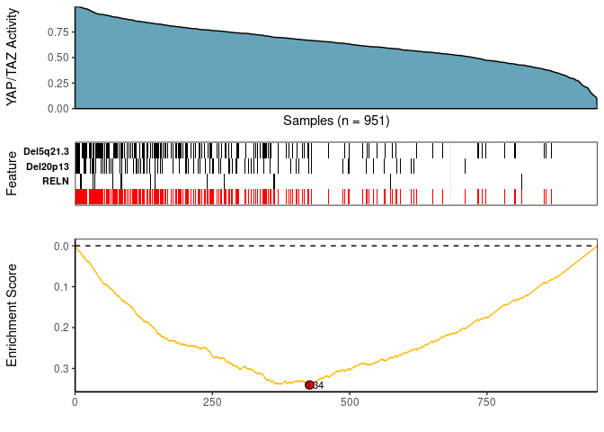

<!-- README.md is generated from README.Rmd. Please edit that file -->

# CaDrA


  

**Ca**ndidate **Dr**ivers **A**nalysis: Multi-Omic Search for Candidate
Drivers of Functional Signatures

**CaDrA** is an R package that supports a heuristic search framework
aimed at identifying candidate drivers of a molecular phenotype of
interest.

The main function takes two inputs:

1)  A binary multi-omics dataset, which can be represented as a matrix
    of binary features or a **SummarizedExperiment** class object where
    the rows are 1/0 vectors indicating the presence/absence of ‘omics’
    features (e.g. somatic mutations, copy number alterations,
    epigenetic marks, etc.), and the columns are the samples.
2)  A molecular phenotype of interest which can be represented as a
    vector of continuous scores (e.g. protein expression, pathway
    activity, etc.)

Based on these two inputs, **CaDrA** implements a forward/backward
search algorithm to find a set of features that together is maximally
associated with the observed input scores, based on one of several
scoring functions (*Kolmogorov-Smirnov*, *Conditional Mutual
Information*, *Wilcoxon*, *custom-defined scoring function*), making it
useful to find complementary omics features likely driving the input
molecular phenotype.

For more information, please see the associated manuscript [Kartha et
al. (2019)](https://www.frontiersin.org/articles/10.3389/fgene.2019.00121/full)

## (1) Installation

- Using `devtools` package

``` r
library(devtools)
devtools::install_github("montilab/CaDrA")
```

- Using `BiocManager` package

``` r
# Install BiocManager
if (!require("BiocManager", quietly = TRUE))
    install.packages("BiocManager")

# Install CaDrA
BiocManager::install("CaDrA")

# Install SummarizedExperiment
BiocManager::install("SummarizedExperiment")
```

## (2) Quickstart

``` r
library(CaDrA)
library(SummarizedExperiment)
```

## (3) CaDrA Query of BRCA YAP/TAZ Activity

### (i) Load & Format Data Inputs

``` r

## Read in BRCA GISTIC+Mutation object
data(BRCA_GISTIC_MUT_SIG)
eset_mut_scna <- BRCA_GISTIC_MUT_SIG

## Read in input score
data(TAZYAP_BRCA_ACTIVITY)
input_score <- TAZYAP_BRCA_ACTIVITY

## Samples to keep based on the overlap between the two inputs
overlap <- intersect(names(input_score), colnames(eset_mut_scna))
eset_mut_scna <- eset_mut_scna[,overlap]
input_score <- input_score[overlap]

## Binarize FS to only have 0's and 1's
assay(eset_mut_scna)[assay(eset_mut_scna) > 1] <- 1.0

## Pre-filter FS based on occurrence frequency
eset_mut_scna_flt <- CaDrA::prefilter_data(
  FS = eset_mut_scna,
  max_cutoff = 0.6,  # max event frequency (60%)
  min_cutoff = 0.03  # min event frequency (3%)
)  
```

### (ii) Run CaDrA

Here, we repeat the candidate search starting from each of the top ‘N’
features and report the combined results as a heatmap (to summarize the
number of times each feature is selected across repeated runs).

IMPORTANT NOTE: The legacy function `topn_eval()` is equivalent to the
new recommended `candidate_search()` function

``` r

topn_res <- CaDrA::candidate_search(
  FS = eset_mut_scna_flt,
  input_score = input_score,
  method = "ks_pval",          # Use Kolmogorow-Smirnow scoring function 
  method_alternative = "less", # Use one-sided hypothesis testing
  weights = NULL,              # If weights is provided, perform a weighted-KS test
  search_method = "both",      # Apply both forward and backward search
  top_N = 7,                   # Evaluate top 7 starting points for each search
  max_size = 7,                # Maximum size a meta-feature matrix can extend to
  do_plot = FALSE,             # Plot after finding the best features
  best_score_only = FALSE      # Return all results from the search
)
```

### (iii) Visualize Best Results

``` r

## Fetch the meta-feature set corresponding to its best scores over top N features searches
topn_best_meta <- CaDrA::topn_best(topn_res)

# Visualize the best results with the meta-feature plot
CaDrA::meta_plot(topn_best_list = topn_best_meta, input_score_label = "YAP/TAZ Activity")
```

<!-- -->

### (iv) Summarize Top N Results

``` r

# Evaluate results across top N features you started from
CaDrA::topn_plot(topn_res) 
```

<!-- -->

## (4) SessionInfo

``` r
sessionInfo()
R version 4.2.3 (2023-03-15)
Platform: x86_64-apple-darwin17.0 (64-bit)
Running under: macOS Big Sur ... 10.16

Matrix products: default
BLAS:   /Library/Frameworks/R.framework/Versions/4.2/Resources/lib/libRblas.0.dylib
LAPACK: /Library/Frameworks/R.framework/Versions/4.2/Resources/lib/libRlapack.dylib

locale:
[1] en_US.UTF-8/en_US.UTF-8/en_US.UTF-8/C/en_US.UTF-8/en_US.UTF-8

attached base packages:
[1] stats4    stats     graphics  grDevices utils     datasets  methods  
[8] base     

other attached packages:
 [1] CaDrA_1.1.1                 testthat_3.2.0             
 [3] devtools_2.4.5              usethis_2.2.2              
 [5] SummarizedExperiment_1.28.0 Biobase_2.58.0             
 [7] GenomicRanges_1.50.2        GenomeInfoDb_1.34.9        
 [9] IRanges_2.32.0              S4Vectors_0.36.2           
[11] BiocGenerics_0.44.0         MatrixGenerics_1.10.0      
[13] matrixStats_1.0.0          

loaded via a namespace (and not attached):
 [1] bitops_1.0-7           fs_1.6.3               doParallel_1.0.17     
 [4] rprojroot_2.0.3        R.cache_0.16.0         tools_4.2.3           
 [7] profvis_0.3.8          utf8_1.2.4             R6_2.5.1              
[10] KernSmooth_2.23-22     colorspace_2.1-0       urlchecker_1.0.1      
[13] withr_2.5.1            tidyselect_1.2.0       prettyunits_1.2.0     
[16] processx_3.8.2         compiler_4.2.3         cli_3.6.1             
[19] desc_1.4.2             DelayedArray_0.24.0    labeling_0.4.3        
[22] caTools_1.18.2         scales_1.2.1           callr_3.7.3           
[25] stringr_1.5.0          digest_0.6.33          R.utils_2.12.2        
[28] rmarkdown_2.25         XVector_0.38.0         pkgconfig_2.0.3       
[31] htmltools_0.5.6.1      sessioninfo_1.2.2      fastmap_1.1.1         
[34] htmlwidgets_1.6.2      rlang_1.1.1            rstudioapi_0.15.0     
[37] shiny_1.7.5.1          farver_2.1.1           generics_0.1.3        
[40] gtools_3.9.4           R.oo_1.25.0            dplyr_1.1.3           
[43] RCurl_1.98-1.12        magrittr_2.0.3         GenomeInfoDbData_1.2.9
[46] Matrix_1.5-3           Rcpp_1.0.11            munsell_0.5.0         
[49] fansi_1.0.5            R.methodsS3_1.8.2      lifecycle_1.0.3       
[52] stringi_1.7.12         yaml_2.3.7             brio_1.1.3            
[55] MASS_7.3-60            zlibbioc_1.44.0        plyr_1.8.9            
[58] pkgbuild_1.4.2         gplots_3.1.3           grid_4.2.3            
[61] misc3d_0.9-1           parallel_4.2.3         promises_1.2.1        
[64] ppcor_1.1              crayon_1.5.2           miniUI_0.1.1.1        
[67] lattice_0.21-9         knitr_1.44             ps_1.7.5              
[70] pillar_1.9.0           tcltk_4.2.3            reshape2_1.4.4        
[73] codetools_0.2-19       pkgload_1.3.3          glue_1.6.2            
[76] evaluate_0.22          remotes_2.4.2.1        vctrs_0.6.4           
[79] httpuv_1.6.11          foreach_1.5.2          gtable_0.3.4          
[82] purrr_1.0.2            cachem_1.0.8           ggplot2_3.4.4         
[85] xfun_0.40              mime_0.12              xtable_1.8-4          
[88] later_1.3.1            tibble_3.2.1           iterators_1.0.14      
[91] memoise_2.0.1          ellipsis_0.3.2        
```

## (5) Acknowledgements

This project is funded in part by the
[NIH/NIDCR](https://www.nidcr.nih.gov/) (3R01DE030350-01A1S1,
R01DE031831), [Find the Cause Breast Cancer
Foundation](https://findthecausebcf.org), and
[NIH/NIA](https://www.nia.nih.gov/) (UH3 AG064704).
