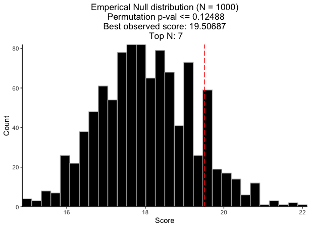

```{r, include=FALSE, messages=FALSE, warnings=FALSE}
knitr::opts_chunk$set(message=FALSE, comment="")
library(CaDrA)
library(SummarizedExperiment)
```

**CaDrA** implements a forward/backward search algorithm to look for a subset of features whose union is maximally associated with an outcome of interest, based on (currently) one of four scoring functions (**Kolmogorov-Smirnov**, **Conditional Mutual Information**, **Wilcoxon**, and **custom-defined**). To test whether the strength of the association between the set of features and the observed input scores (e.g., pathway activity, drug sensitivity, etc.) is greather than it would be expected by chance, **CaDrA** supports permutation-based significance testing. Importantly, the permutation test iterates over the entire search procedure (e.g., if `topN = 10`, each permutation iteration will consist of running the search over the top 10 features).

# Load packages

```r
library(CaDrA)
library(SummarizedExperiment)
```

# Load required datasets

1. A `binary features matrix` also known as `Feature Set` (such as somatic mutations, copy number alterations, chromosomal translocations, etc.) The 1/0 vectors indicate the presence/absence of ‘omics’ features in the samples. The `Feature Set` must be an object of class **RangedSummarizedExperiment** from **SummarizedExperiment** package) 
2. A vector of continuous scores (or `input_score`) representing a functional response of interest (such as protein expression, pathway activity, etc.)

```{r load.data}

# Load pre-simulated dataset 
# See ?sim_FS for more information
data(sim_FS)

# Load pre-computed input-score
# See ?sim_Scores for more information
data(sim_Scores)

```

# Find a subset of features that maximally associated with a given outcome of interest

Here we are using **Kolmogorow-Smirnow** (KS) scoring method to search for best features

```{r ks.method}

ks_candidate <- CaDrA::candidate_search(
  FS = sim_FS,
  input_score = sim_Scores,
  method = "ks",               # Use Kolmogorow-Smirnow scoring function 
  alternative = "less",        # one-sided p-value
  weight = NULL,              # If weight is provided, it will be used to perform a weighted-KS test
  metric = "pval",             # Use p-value to search for best feature
  search_method = "both",      # Apply both forward and backward search
  top_N = 1,                   # Number of top features to kick start the search
  max_size = 10,               # Set max_size = 10 to account for 10 left-skewed features in sim_FS
  best_score_only = FALSE      # If best_score_only = FALSE, it will return meta-feature ESet, 
                               # its observed input scores and corresponding best score
)

```

# Visualize best meta-features result

```{r ks.meta.plot}

# Extract the best meta-feature result
topn_best_meta <- topn_best(topn_list = ks_candidate)

# Visualize meta-feature result
meta_plot(topn_best_list = topn_best_meta)

```

# Permutation-based testing

```r

ks_perm_res <- CaDrA::CaDrA(
  FS = sim_FS, 
  input_score = sim_Scores, 
  method = "ks",               # Use Kolmogorow-Smirnow scoring function 
  weight = NULL,              # If weight is provided, it will be used to perform a weighted-KS test
  alternative = "less",        # one-sided p-value
  metric = "pval",             # Use p-value to search for best feature
  search_method = "both",      # Apply both forward and backward search
  top_N = 1,                   # Repeat the search with the top feature
  max_size = 10,               # Set max_size = 10 to allow at most 10 features in meta-feature
  n_perm = 1000,               # number of permutations
  plot = FALSE,                # we will plot later
  ncores = 1                   # number of cores to perform parallelization for permutation testing
)

```

# Visualize permutation result

```r

# Visualize permutation results
permutation_plot(perm_res = ks_perm_res)

```



